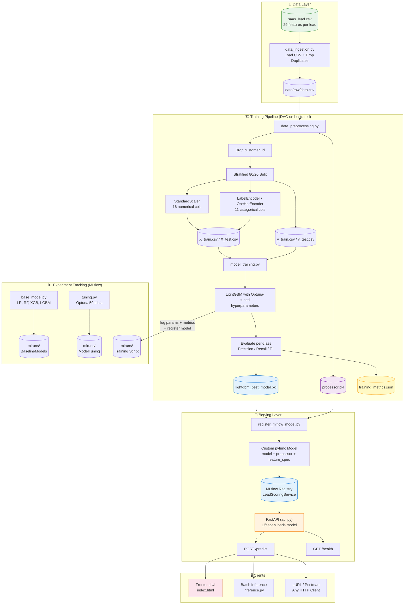
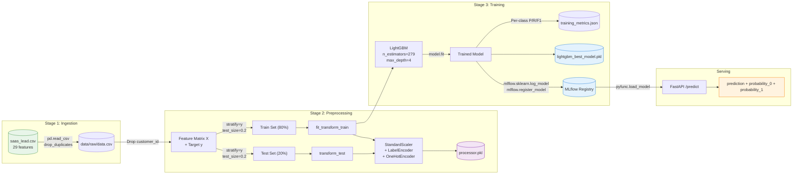
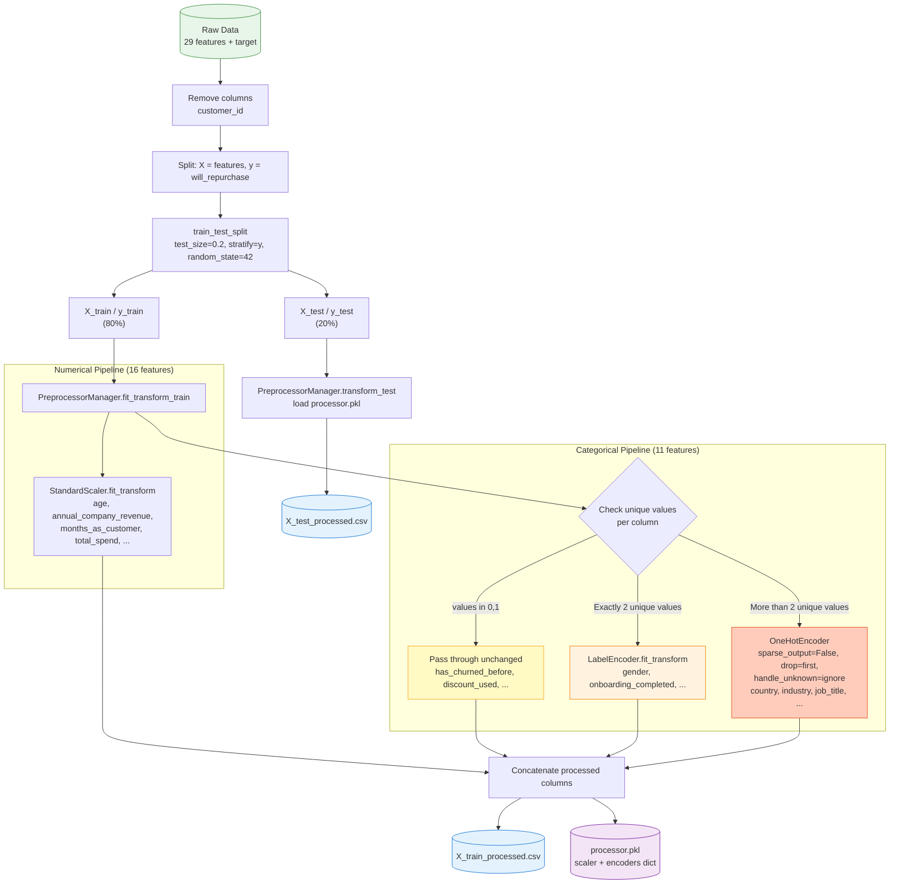
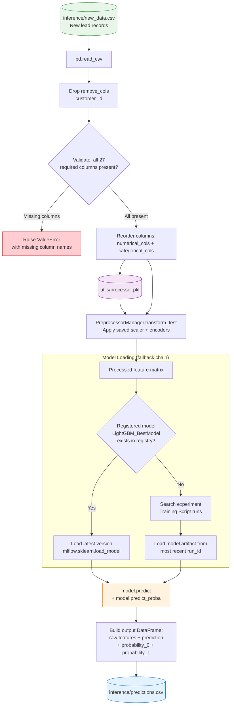

<div align="center">

# 🎯 SaaS Lead Scoring — End-to-End ML Pipeline

**Predict which SaaS customers will repurchase using an Optuna-tuned LightGBM model, tracked with MLflow, orchestrated via DVC, and served through a FastAPI REST API with a browser-based UI.**

<br/>


</div>

---

## 📑 Table of Contents

- [About The Project](#about-the-project)
- [Features](#features)
- [Tech Stack](#tech-stack)
- [Architecture](#architecture)
- [Project Structure](#project-structure)
- [Installation](#installation)
- [Configuration](#configuration)
- [Usage](#usage)
- [API Documentation](#api-documentation)
- [Machine Learning Pipeline](#machine-learning-pipeline)
- [Performance Metrics](#performance-metrics)
- [Deployment](#deployment)
- [Security Considerations](#security-considerations)
- [Roadmap](#roadmap)
- [Contributing](#contributing)
- [License](#license)
- [Author](#author)
- [Acknowledgements](#acknowledgements)

---

## About The Project

### Problem Statement

SaaS companies invest heavily in marketing and customer success, but not every lead converts to a repeat buyer. Without a reliable way to identify which customers are likely to repurchase, sales and marketing teams waste resources on low-probability leads while high-value prospects go under-served.

### Solution Overview

This project delivers a **production-ready, end-to-end machine learning system** that predicts whether a SaaS customer will repurchase (binary classification). It spans the entire ML lifecycle:

1. **Exploratory Data Analysis** — Jupyter notebooks for distribution analysis, class balance, and feature correlations.
2. **Reproducible Training Pipeline** — A three-stage DVC pipeline (ingest → preprocess → train) with full MLflow experiment tracking.
3. **Hyperparameter Tuning** — 50-trial Optuna study to find the best LightGBM configuration, maximizing macro F1 score.
4. **Batch Inference** — A standalone script that loads new leads, applies the saved preprocessor, fetches the latest registered MLflow model, and writes predictions with class probabilities.
5. **REST API Service** — A FastAPI server wrapping the model as a custom MLflow `pyfunc` for environment-independent serving.
6. **Interactive Frontend** — A plain HTML/JS form-based UI that calls the API and visualizes prediction results with probability bars.

### Target Audience

- **Sales & Marketing Teams** — Prioritize outreach to high-probability leads.
- **Data Scientists** — Reproduce experiments and iterate on the model.
- **ML Engineers** — Deploy and serve the model in production.
- **Hiring Managers & Recruiters** — Evaluate end-to-end ML engineering competency.

### Business Value

- **Reduce churn** by proactively engaging high-value customers.
- **Optimize marketing spend** by focusing campaigns on leads most likely to convert.
- **Enable data-driven decision-making** across sales funnels.

---

## Features

### Core Features

- ✅ Binary classification predicting customer repurchase likelihood
- ✅ Three-stage DVC pipeline: data ingestion → preprocessing → model training
- ✅ Full MLflow experiment tracking, model logging, and model registry
- ✅ Optuna-powered hyperparameter tuning (50 trials)
- ✅ Batch inference with class probability output

### Advanced Features

- ✅ Custom MLflow `pyfunc` model packaging (preprocessor + model + feature spec bundled as a single artifact)
- ✅ Serializable `PreprocessorManager` handling StandardScaler, LabelEncoder, and OneHotEncoder
- ✅ Stratified train/test splitting to preserve class balance
- ✅ Per-class metrics (precision, recall, F1) logged for both train and test sets
- ✅ Deployable Python wheel via `pyproject.toml`

### Technical Features

- ✅ FastAPI REST endpoint with Pydantic request validation
- ✅ CORS-enabled API for browser-based clients
- ✅ Health check endpoint (`GET /health`)
- ✅ Async lifespan-managed model loading
- ✅ Interactive single-lead scoring UI with live probability bars

---

## Tech Stack

| Category                  | Technology                                                |
| ------------------------- | --------------------------------------------------------- |
| **Language**              | Python 3.11+                                              |
| **ML Framework**          | LightGBM 4.6, XGBoost 3.2, Scikit-learn 1.8              |
| **Hyperparameter Tuning** | Optuna 4.0                                                |
| **Experiment Tracking**   | MLflow 3.10 (tracking, registry, `pyfunc` model packaging)|
| **Pipeline Orchestration**| DVC 3.50                                                  |
| **API Framework**         | FastAPI ≥ 0.115 + Uvicorn ≥ 0.30                          |
| **Data Processing**       | Pandas 3.0, NumPy 2.4                                     |
| **Visualization (EDA)**   | Matplotlib 3.10, Seaborn 0.13                              |
| **Statistics**            | Statsmodels 0.14 (VIF analysis)                            |
| **Serialization**         | Joblib, Cloudpickle                                        |
| **Validation**            | Pydantic ≥ 2.0                                             |
| **Frontend**              | HTML5, Vanilla JavaScript, CSS                              |
| **Packaging**             | Setuptools + Wheel (`pyproject.toml`)                      |

---

## Architecture

### High-Level System Architecture



### Data Flow



### Component Interaction

| Component | Responsibility |
|-----------|---------------|
| `training_pipeline/components/data_ingestion.py` | Load raw CSV, remove duplicates, save to pipeline data directory |
| `training_pipeline/components/data_preprocessing.py` | Stratified split, fit/transform preprocessor, serialize to `processor.pkl` |
| `training_pipeline/components/model_training.py` | Train LightGBM with tuned hyperparameters, log to MLflow, register model |
| `training_pipeline/pipelines/pipeline.py` | Orchestrate all three stages sequentially |
| `utils/utils.py` | `PreprocessorManager` class, VIF analysis, data loading utilities |
| `utils/features.py` | Centralized feature definitions (16 numerical, 11 categorical, target, remove) |
| `experiments/base_model.py` | Benchmark 4 baseline models (LR, RF, XGBoost, LightGBM) with MLflow |
| `experiments/tuning.py` | Optuna study to tune LightGBM hyperparameters |
| `inference/inference.py` | Batch scoring: load new data → preprocess → predict → save CSV |
| `deployment_package/src/lead_scoring_service/pyfunc_model.py` | Custom MLflow `PythonModel` wrapping preprocessor + model |
| `deployment_package/src/lead_scoring_service/api.py` | FastAPI application with `/predict` and `/health` endpoints |
| `deployment_package/scripts/register_mlflow_model.py` | Package and register the pyfunc model in MLflow |
| `frontend/index.html` | Interactive lead scoring form with probability visualization |

---

## Project Structure

```text
End-to-End ML Project for a SaaS Product/
│
├── 📄 README.md                          # Project documentation
├── 📄 requirements.txt                   # Python dependencies
│
├── 📓 notebooks/                         # Exploratory Data Analysis
│   ├── eda.ipynb                         # Distribution analysis, feature correlations
│   ├── preprocessing.ipynb              # Feature engineering exploration
│   └── balancing.ipynb                  # Class balance analysis
│
├── 🔧 utils/                            # Shared utilities
│   ├── features.py                      # Feature column definitions (numerical, categorical, target)
│   ├── utils.py                         # PreprocessorManager, VIF, data loading, stratified split
│   └── processor.pkl                    # Serialized fitted preprocessor
│
├── 🏗️ training_pipeline/                # DVC-orchestrated training pipeline
│   ├── components/
│   │   ├── data_ingestion.py            # Stage 1: Load + deduplicate raw data
│   │   ├── data_preprocessing.py        # Stage 2: Split + scale + encode
│   │   └── model_training.py            # Stage 3: Train LightGBM + log to MLflow
│   ├── pipelines/
│   │   └── pipeline.py                  # Orchestrator: runs all 3 stages sequentially
│   ├── metrics/
│   │   └── training_metrics.json        # Saved per-class precision, recall, F1
│   └── models/
│       └── lightgbm_best_model.pkl      # Trained model artifact (~500 KB)
│
├── 🧪 experiments/                       # Model experimentation
│   ├── base_model.py                    # Baseline: LR, RF, XGBoost, LightGBM
│   ├── tuning.py                        # Optuna hyperparameter search (50 trials)
│   └── mlruns/                          # MLflow tracking data (auto-generated)
│
├── 🔮 inference/                         # Batch inference
│   ├── inference.py                     # Score new leads from CSV
│   ├── new_data.csv                     # Sample input (2 lead records)
│   └── predictions.csv                  # Output predictions with probabilities
│
├── 🚀 deployment_package/                # Production deployment package
│   ├── README.md                        # Deployment-specific documentation
│   ├── pyproject.toml                   # Python package configuration
│   ├── artifacts/
│   │   └── feature_spec.pkl             # Serialized feature specification
│   ├── scripts/
│   │   └── register_mlflow_model.py     # Register pyfunc model in MLflow
│   └── src/
│       └── lead_scoring_service/
│           ├── __init__.py
│           ├── api.py                   # FastAPI application
│           └── pyfunc_model.py          # Custom MLflow PythonModel wrapper
│
└── 🖥️ frontend/
    └── index.html                       # Interactive lead scoring UI
```

---

## Installation

### Prerequisites

- **Python 3.11** or higher
- **pip** (package manager)
- **Git** (to clone the repository)

### Clone Repository

```bash
git clone https://github.com/<your-username>/saas-lead-scoring.git
cd saas-lead-scoring
```

### Create Virtual Environment

```bash
python -m venv venv

# Windows
venv\Scripts\activate

# macOS / Linux
source venv/bin/activate
```

### Install Dependencies

```bash
pip install -r requirements.txt
```

For the deployment package (FastAPI serving), install additional dependencies:

```bash
pip install fastapi uvicorn pydantic cloudpickle
```

### Prepare the Dataset

Place your raw SaaS lead dataset at:

```
data/raw/saas_lead.csv
```

The dataset should contain **29 features** per lead including demographics, company profile, purchase behavior, product usage, and support & marketing attributes.

---

## Configuration

### Feature Definitions

Feature columns are centrally defined in [`utils/features.py`](utils/features.py):

```python
# 16 numerical features
numerical_cols = [
    'age', 'annual_company_revenue', 'months_as_customer', 'total_spend',
    'num_purchases', 'last_purchase_days_ago', 'monthly_active_days',
    'avg_session_duration_min', 'features_used_count', 'api_calls_last_30_days',
    'product_tours_completed', 'support_tickets_total', 'avg_ticket_resolution_hours',
    'sat_score', 'campaigns_received', 'last_marketing_touch_days_ago'
]

# 11 categorical features
categorical_cols = [
    'gender', 'country', 'company_size', 'industry', 'job_title',
    'plan_type', 'has_churned_before', 'discount_used', 'onboarding_completed',
    'attended_webinar', 'social_media_engaged'
]

target_col = 'will_repurchase'   # Binary: 0 (no) / 1 (yes)
remove_cols = ['customer_id']    # Dropped before training
```

### Environment Variables (Deployment)

| Variable | Default | Description |
|----------|---------|-------------|
| `MLFLOW_TRACKING_URI` | `file:///...experiments/mlruns` | MLflow tracking server URI |
| `MODEL_URI` | `models:/LeadScoringService/latest` | MLflow model URI for API serving |
| `MODEL_FILE_PATH` | `training_pipeline/models/lightgbm_best_model.pkl` | Path to trained model file |
| `PROCESSOR_FILE_PATH` | `utils/processor.pkl` | Path to fitted preprocessor |
| `REGISTERED_MODEL_NAME` | `LeadScoringService` | Name in MLflow model registry |
| `EXPERIMENT_NAME` | `DeploymentPackaging` | MLflow experiment for deployment runs |

---

## Usage

### 1. Run Exploratory Data Analysis

```bash
jupyter notebook notebooks/eda.ipynb
```

Notebooks cover:
- **`eda.ipynb`** — Distribution analysis, class balance, feature correlations
- **`preprocessing.ipynb`** — Feature engineering exploration
- **`balancing.ipynb`** — Class imbalance analysis

### 2. Run the Training Pipeline

Execute the full three-stage pipeline:

```bash
python training_pipeline/pipelines/pipeline.py
```

This runs sequentially:
1. **Data Ingestion** — Loads `data/raw/saas_lead.csv`, removes duplicates
2. **Data Preprocessing** — Stratified 80/20 split, fits StandardScaler + encoders, saves `processor.pkl`
3. **Model Training** — Trains Optuna-tuned LightGBM, logs to MLflow, registers model

### 3. Run Baseline Experiments

Benchmark four models with MLflow tracking:

```bash
python experiments/base_model.py
```

This trains and logs: Logistic Regression, Random Forest, XGBoost, and LightGBM.

### 4. Run Hyperparameter Tuning

Run a 50-trial Optuna study on LightGBM:

```bash
python experiments/tuning.py
```

### 5. Run Batch Inference

Score new leads from a CSV file:

```bash
python inference/inference.py
```

- **Input:** `inference/new_data.csv`
- **Output:** `inference/predictions.csv` (predictions + class probabilities)

**Sample output:**

| age | gender | country | ... | prediction | probability_0 | probability_1 |
|-----|--------|---------|-----|------------|---------------|---------------|
| 60  | Female | USA     | ... | 0          | 0.885         | 0.115         |
| 50  | Female | Canada  | ... | 1          | 0.284         | 0.716         |

### 6. View MLflow Dashboard

```bash
mlflow ui --backend-store-uri experiments/mlruns
```

Navigate to `http://127.0.0.1:5000` to explore experiments, compare runs, and inspect model artifacts.

### 7. Serve the API

```bash
# Step 1: Register the pyfunc model
python deployment_package/scripts/register_mlflow_model.py

# Step 2: Start the FastAPI server
python -m uvicorn lead_scoring_service.api:app --reload --app-dir deployment_package/src
```

### 8. Use the Frontend

Open `frontend/index.html` in a browser (with the API running) to interactively score individual leads through the form-based UI.

---

## API Documentation

### Base URL

```
http://127.0.0.1:8000
```

---

### Health Check

```http
GET /health
```

**Response:**
```json
{
  "status": "ok"
}
```

---

### Predict Lead Score

```http
POST /predict
Content-Type: application/json
```

**Request Body:**
```json
{
  "rows": [
    {
      "customer_id": "CUST-00001",
      "age": 60,
      "gender": "Female",
      "country": "USA",
      "company_size": "201 to 500",
      "industry": "Education",
      "job_title": "Manager",
      "annual_company_revenue": 75849462,
      "plan_type": "Starter",
      "months_as_customer": 32,
      "total_spend": 517,
      "num_purchases": 9,
      "last_purchase_days_ago": 325,
      "has_churned_before": 0,
      "discount_used": 0,
      "monthly_active_days": 28,
      "avg_session_duration_min": 5.8,
      "features_used_count": 2,
      "api_calls_last_30_days": 22761,
      "product_tours_completed": 1,
      "onboarding_completed": 1,
      "support_tickets_total": 9,
      "avg_ticket_resolution_hours": 5.9,
      "sat_score": 5,
      "campaigns_received": 7,
      "last_marketing_touch_days_ago": 100,
      "attended_webinar": 0,
      "social_media_engaged": 1
    }
  ]
}
```

**Response (200 OK):**
```json
[
  {
    "prediction": 0,
    "prediction_probability_0": 0.8848,
    "prediction_probability_1": 0.1152
  }
]
```

**Error Responses:**

| Status | Description |
|--------|-------------|
| `400`  | Invalid request body or missing required columns |
| `503`  | Model not loaded (server still initializing) |

---

## Machine Learning Pipeline

### Dataset

- **Source:** SaaS customer records
- **Size:** ~29 features per lead
- **Target Variable:** `will_repurchase` (binary: 0 = No, 1 = Yes)
- **Feature Categories:**
  - **Demographics:** age, gender, country
  - **Company Profile:** company_size, industry, job_title, annual_company_revenue
  - **Purchase Behavior:** months_as_customer, total_spend, num_purchases, last_purchase_days_ago
  - **Product Usage:** monthly_active_days, avg_session_duration_min, features_used_count, api_calls_last_30_days
  - **Support & Marketing:** support_tickets_total, sat_score, campaigns_received, attended_webinar

### Preprocessing



**Key design decisions:**
- **Stratified splitting** preserves class balance in train/test sets
- **Encoding strategy** is automatically determined per-column based on cardinality
- **Processor serialization** ensures identical transforms at inference time

### Model Selection & Training

Four baseline models were benchmarked with MLflow:

| Model | Purpose |
|-------|---------|
| Logistic Regression | Linear baseline |
| Random Forest | Ensemble baseline |
| XGBoost | Gradient boosting baseline |
| **LightGBM** | **Selected model** — best F1 performance |

### Hyperparameter Tuning

**Method:** Optuna Bayesian optimization (50 trials, maximizing macro F1 on test set)

**Tuned hyperparameters and best values:**

| Parameter | Search Range | Best Value |
|-----------|-------------|------------|
| `n_estimators` | 50 – 300 | **279** |
| `learning_rate` | 0.01 – 0.3 | **0.0338** |
| `max_depth` | 3 – 10 | **4** |
| `num_leaves` | 20 – 100 | **100** |
| `subsample` | 0.5 – 1.0 | **0.589** |
| `colsample_bytree` | 0.5 – 1.0 | **0.858** |

### Inference Pipeline



---

## Performance Metrics

### Final Model: LightGBM (Optuna-Tuned)

**Training Set Performance:**

| Class | Precision | Recall | F1 Score |
|-------|-----------|--------|----------|
| **0** (Will NOT Repurchase) | 0.7716 | 0.6961 | 0.7319 |
| **1** (Will Repurchase) | 0.8291 | 0.8774 | 0.8525 |

**Test Set Performance:**

| Class | Precision | Recall | F1 Score |
|-------|-----------|--------|----------|
| **0** (Will NOT Repurchase) | 0.6647 | 0.6166 | 0.6398 |
| **1** (Will Repurchase) | 0.7813 | 0.8150 | 0.7978 |

**Summary:**

| Metric | Value |
|--------|-------|
| Test F1 (Class 1 — Repurchase) | **0.798** |
| Test F1 (Class 0 — No Repurchase) | **0.640** |
| Test Precision (Class 1) | **0.781** |
| Test Recall (Class 1) | **0.815** |
| Model File Size | **~500 KB** |

---

## Deployment

### Local API Deployment

```bash
# 1. Register the model as an MLflow pyfunc
python deployment_package/scripts/register_mlflow_model.py

# 2. Start the FastAPI server
python -m uvicorn lead_scoring_service.api:app --reload --app-dir deployment_package/src

# 3. Open the frontend
# Open frontend/index.html in your browser
```

### Build as a Python Wheel

The deployment package is structured as a standard Python package:

```bash
cd deployment_package
pip install build
python -m build
```

This produces a wheel in `deployment_package/dist/` that can be installed anywhere:

```bash
pip install dist/lead_scoring_service-0.1.0-py3-none-any.whl
```

### MLflow Model Registry

The custom `pyfunc` model bundles three artifacts into a single registerable unit:

| Artifact | Purpose |
|----------|---------|
| `model` | Trained LightGBM `.pkl` file |
| `processor` | Fitted `PreprocessorManager` (scaler + encoders) |
| `feature_spec` | Feature column lists for validation |

This ensures **environment-independent serving** — the model is fully self-contained.

---

## Security Considerations

| Area | Implementation |
|------|---------------|
| **Input Validation** | Pydantic `BaseModel` with `Field(min_length=1)` validates all API requests |
| **CORS Policy** | Configured via `CORSMiddleware` (currently `allow_origins=["*"]` — restrict in production) |
| **Error Handling** | API returns structured `HTTPException` responses, never exposes stack traces |
| **Model Loading** | Async lifespan management ensures model is loaded before serving requests |
| **Secrets** | No hardcoded secrets; environment variables for all configurable paths |
| **Type Coercion** | Float columns explicitly cast to prevent type mismatch errors |

> ⚠️ **Production Recommendation:** Restrict `allow_origins` to specific frontend domains and add authentication middleware (e.g., API key or OAuth2) before deploying to production.


## Contributing

Contributions are welcome! Follow these steps:

1. **Fork** the repository
2. **Create** a feature branch
   ```bash
   git checkout -b feature/your-feature-name
   ```
3. **Commit** your changes with descriptive messages
   ```bash
   git commit -m "feat: add SHAP explanations to prediction output"
   ```
4. **Push** to your fork
   ```bash
   git push origin feature/your-feature-name
   ```
5. **Open** a Pull Request with a clear description of changes

### Guidelines

- Follow existing code style and project structure
- Add docstrings to new functions and classes
- Update documentation for any new features
- Test changes locally before submitting

---

## License

This project is open source and available under the [MIT License](LICENSE).

---

## Author

<div align="center">

**Yousuf Ansari**

[](https://github.com/Yousuf-177)


</div>

---

## Acknowledgements

- [LightGBM](https://github.com/microsoft/LightGBM) — Gradient boosting framework by Microsoft
- [MLflow](https://mlflow.org/) — Open-source MLOps platform
- [Optuna](https://optuna.org/) — Hyperparameter optimization framework
- [DVC](https://dvc.org/) — Data version control for ML pipelines
- [FastAPI](https://fastapi.tiangolo.com/) — Modern Python web framework for APIs
- [Scikit-learn](https://scikit-learn.org/) — Machine learning toolkit for preprocessing and evaluation
- [Pandas](https://pandas.pydata.org/) — Data manipulation and analysis library
